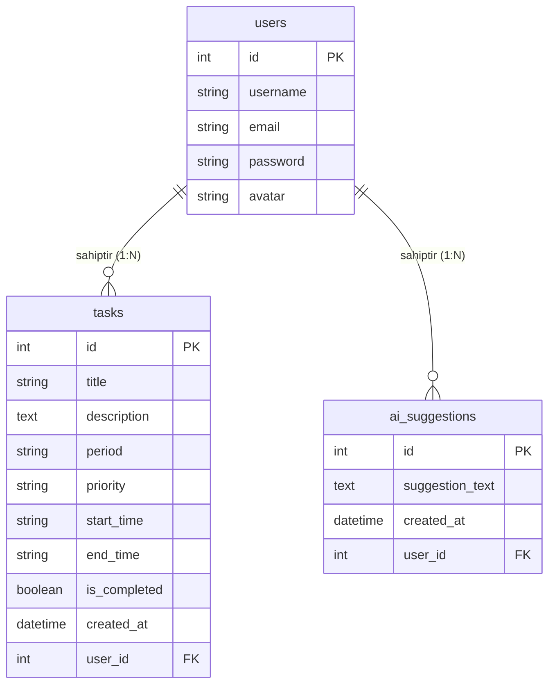

# 📝 Glide - Akıllı Görev ve Zaman Yönetim Sistemi - Proje Raporu

---

## 📌 Proje Tanıtımı
* **Proje Adı:** Glide - Akıllı Görev ve Zaman Yönetim Sistemi (Smart Task Manager)
* **Geliştirici:** Şahin (sahin-1-7)
* **Amaç:** Kullanıcıların günlük, haftalık ve aylık görevlerini ekleyebileceği, arayabileceği, önem derecelerine göre listeleyebileceği ve en önemlisi **Yapay Zeka (AI) Algoritması** sayesinde zaman çakışmalarını tespit edip verimlilik önerileri alabileceği web tabanlı akıllı bir ajanda uygulaması geliştirmek.

---

## 1. Giriş ve Amaç
Modern yaşamda bireylerin karşılaştığı en büyük zorluklardan biri sınırlı zamanı verimli yönetememektir. Klasik yapılacaklar listesi (To-Do List) uygulamaları sadece işlerin listelenmesini sağlarken, zamanlama çakışmalarını yönetemez ve kullanıcılara verimlilik tavsiyeleri sunamaz. 

Bu projenin amacı:
* Kullanıcılara görevlerini önem derecelerine (High, Medium, Low) ve periyotlarına (Daily, Weekly, Monthly) göre gruplandırma olanağı sunmak.
* Arka planda çalışan akıllı bir analiz motoruyla, saat çakışmalarını anında bularak kullanıcıyı uyarmak.
* Görevleri en yüksek üretkenliği sağlayacak şekilde otomatik olarak yeniden sıralamak ve verimlilik raporu üretmek.
* Çoklu dil desteğiyle küresel ölçekte kullanılabilir bir yapı kurmak.

---

## 2. Kullanılan Teknolojiler ve Kütüphaneler

### 🖥️ Backend (Sunucu Tarafı)
* **Python 3.x**: Uygulamanın temel programlama dili.
* **Flask (v3.x)**: Hafif, modüler ve yüksek performanslı Python Web mikro-çatısı.
* **Flask-SQLAlchemy**: SQLite veritabanı ile ORM (Object-Relational Mapping) üzerinden iletişim kurmak için kullanıldı.
* **Flask-Migrate**: Veritabanı şema güncellemelerini ve göçlerini (migrations) yönetmek için kullanıldı.
* **Flask-Login**: Kullanıcı oturumlarını (session), güvenli giriş/çıkış ve sayfa bazlı yetkilendirmeleri yönetmek için entegre edildi.
* **Flask-Babel**: Uygulamaya tam entegre Türkçe (TR) ve İngilizce (EN) çoklu dil desteği kazandırdı.
* **Werkzeug Security**: Şifrelerin veritabanına düz metin yerine PBKDF2 şifreleme algoritması ile hash'lenerek kaydedilmesini sağladı.

### 🎨 Frontend (İstemci Tarafı)
* **HTML5 & Jinja2 Şablon Motoru**: Sunucu tarafında hazırlanan verilerin dinamik olarak HTML sayfalarına basılmasını sağladı.
* **CSS3 (Custom Dark Mode UI)**: Modern, göz yormayan ve son derece şık bir karanlık tema tasarımı sıfırdan inşa edildi. Cam efekti (glassmorphism) ve yumuşak animasyonlarla premium bir his oluşturuldu.
* **Vanilla JavaScript**: Arayüzdeki dinamik geçişler, dil seçimleri ve hızlı arama etkileşimleri için kullanıldı.

---

## 3. Sistem Mimarisi ve Klasör Yapısı

Proje, Flask'in en iyi pratiklerinden biri olan **Blueprint (Uygulama Fabrikası)** yapısına uygun olarak tasarlanmıştır. Bu mimari sayesinde kodlar işlevlerine göre ayrıştırılmış ve sürdürülebilirlik maksimuma çıkarılmıştır.

### 📂 Klasör Yapısı Açıklaması:
```text
final ödev/
│
├── app/                        # Ana Uygulama Klasörü
│   ├── blueprints/             # Modüler Yapı (Blueprints)
│   │   ├── api/                # API Uç Noktaları (Gelecekteki Mobil/SPA entegrasyonu için)
│   │   ├── auth/               # Giriş, Kayıt ve Şifre Sıfırlama İşlemleri
│   │   ├── main/               # Hata Sayfaları, Profil ve Ana Sayfa
│   │   └── tasks/              # Görev CRUD ve AI Optimizasyon İşlemleri
│   │
│   ├── static/                 # Statik Dosyalar (CSS, JS, Görseller)
│   │   ├── css/style.css       # Özelleştirilmiş Modern CSS Tasarımı
│   │   ├── js/app.js           # İstemci Etkileşimleri
│   │   └── uploads/            # Kullanıcı Profil Resimleri (Avatarlar)
│   │
│   ├── templates/              # Jinja2 HTML Şablonları
│   ├── translations/           # Flask-Babel Dil Çeviri Klasörleri (TR/EN)
│   │
│   ├── __init__.py             # Uygulama Başlatma ve Eklenti Tanımlamaları
│   ├── ai_engine.py            # Akıllı Zaman Çakışması ve AI Analiz Motoru
│   ├── config.py               # Çevre Değişkenleri ve Konfigürasyonlar
│   ├── extensions.py           # Eklenti Nesnelerinin Tanımları (db, migrate, babel)
│   ├── models.py               # Veritabanı Tablo Yapıları (Modeller)
│   └── utils.py                # Merkezi Yardımcı Fonksiyonlar (E-posta, Token ve Saat Hesaplama)
│
├── instance/                   # SQLite Veritabanı Dosyasının Tutulduğu Yer
├── migrations/                 # Veritabanı Göç Geçmişi
├── run.py                      # Uygulamayı Başlatan Ana Dosya (Giriş Noktası)
├── requirements.txt            # Bağımlı Kütüphanelerin Listesi
└── .gitignore                  # Git Tarafından Takip Edilmeyecek Dosyalar (.env, venv vb.)
```

---

## 4. Veritabanı Tasarımı (ER Modeli)

Sistemde SQLite ilişkisel veritabanı kullanılmıştır. Modeller arasındaki ilişkiler veritabanı bütünlüğünü koruyacak şekilde tasarlanmıştır.



### Tablo Yapıları ve İlişkiler:
1. **`User` (Kullanıcılar Tablosu):** Her kullanıcının tekil bir `id`'si, benzersiz `username` ve `email` adresi bulunur. `tasks` ve `suggestions` tabloları ile bire-çok (1:N) ilişkilidir. Kullanıcı hesabı silindiğinde `cascade="all, delete-orphan"` yapısı sayesinde kullanıcıya ait tüm görevler ve AI raporları otomatik olarak temizlenir.
2. **`Task` (Görevler Tablosu):** Görevin başlığı, açıklaması, hangi periyoda ait olduğu (`daily`, `weekly`, `monthly`), öncelik derecesi (`High`, `Medium`, `Low`) ve görev zaman aralığı (`start_time`, `end_time`) formatlı string olarak saklanır. `user_id` üzerinden ilgili kullanıcıya bağlıdır.
3. **`AISuggestion` (Yapay Zeka Raporları):** Yapay zekanın ürettiği zengin Markdown formatındaki analiz metinlerini arşivler. `user_id` yabancı anahtarı (Foreign Key) ile kullanıcıya bağlanır.

---

## 5. Uygulanan Fonksiyonel Özellikler ve Kazanımlar

### 🔒 Güvenli Üyelik ve Profil Yönetimi (Bonus +4 Puan)
* Kullanıcılar sisteme e-posta ve şifreleriyle kayıt olabilir.
* Giriş yapan kullanıcılar, kendilerine özel bir profile sahip olurlar ve sızma testlerinden geçecek düzeyde güvenliğe sahip olan **Güvenli Profil Resmi (Avatar) Yükleme Modülü**'nü kullanabilirler.
* **Dosya Yükleme Güvenlik Mimarisi (Sızma Testi Korumaları):**
  * **Path Traversal ve Null Byte Engelleme:** Dosyaların `secure_filename` mantığına uygun olarak kriptografik UUIDv4 kodları ile yeniden adlandırılması sağlanmış, böylece sunucuda dosyaların üst üste yazılması ve dizin geçişi (directory traversal) saldırıları tamamen önlenmiştir.
  * **Sıkı Uzantı ve MIME-Type Kontrolü:** Yalnızca `png`, `jpg`, `jpeg`, `gif` uzantılarına izin verilmiştir. HTML veya Javascript enjekte edilebilen ve XSS'e sebep olan `svg` gibi uzantılar engellenmiştir.
  * **Pillow ile Derin İçerik Doğrulaması:** Dosya içeriği bellek seviyesinde Pillow (`PIL`) ile doğrulanarak HTTP başlıklarının manipüle edilip zararlı PHP/HTML kodlarının resim gibi sunulması (MIME-Type spoofing) engellenmiştir.
  * **Polyglot ve EXIF Temizleme (Sanitization):** Resim dosyaları bellekte sıfırdan oluşturulan temiz bir tuval üzerine yeniden çizilip kaydedilmektedir (re-saving). Bu işlem resim dosyası içerisine gizlenmiş tüm PHP/HTML betiklerini kazıyıp temizlemektedir.
  * **Eski Dosya Temizliği:** Kullanıcı yeni bir fotoğraf yüklediğinde eski resmi sunucu diskinden otomatik olarak silinerek sunucu güvenliği ve depolama verimliliği korunmuştur.

### 📅 Dinamik Dashboard ve CRUD
* Kullanıcılar kolayca yeni görevler ekleyebilir, mevcut görevleri listeleyebilir, tamamlandı olarak işaretleyebilir veya tamamen silebilir.
* Görevler eklenirken başlangıç ve bitiş saatleri girilir (Örn: 09:00 - 10:30).

### 🔍 SQL LIKE Tabanlı Hızlı Arama & Filtreleme (Bonus +3 Puan)
* Arama çubuğuna yazılan anahtar kelimeler, SQL'deki `LIKE` operatörü kullanılarak veritabanında görev başlığı veya açıklamasında gerçek zamanlı aranır.
* Görevler; Günlük, Haftalık, Aylık veya Öncelik Derecesine göre tek tıkla filtrelenebilir.

### 🌐 Çoklu Dil Desteği (Flask-Babel Entegrasyonu) (Bonus +5 Puan)
* Sistem Türkçe ve İngilizce dil seçeneklerini tam olarak destekler.
* Dil seçimi üst menüdeki butonlar aracılığıyla dinamik olarak değiştirilebilir ve kullanıcının seçimi oturumda (`session`) saklanır.
* Jinja şablonlarındaki tüm metinler ve hata mesajları `gettext` (`_()`) fonksiyonları ile yerelleştirilmiştir.

### 🧠 Yapay Zeka (AI) Planlama ve Zaman Çakışması Analizi (Ana Tema)
* **Zaman Çakışması Algoritması:** Sistem, kullanıcının eklediği görevlerin saatlerini analiz eder. Eğer aynı periyotta yer alan iki görevin saat aralıkları çakışıyorsa (Örn: 10:00-11:00 arası spor ve 10:30-12:00 arası toplantı), sistem bunu anında bulur ve kullanıcıyı uyarır.
* **Akıllı Öncelik Sıralaması:** Görevler, AI motoru tarafından öncelik ağırlıklarına göre (Yüksek > Orta > Düşük) ve başlangıç saatlerine göre sıralanarak optimize edilmiş bir zaman çizelgesi haline getirilir.
* **Kişiselleştirilmiş Öneriler:** Kullanıcının iş yükü analiz edilerek (örneğin günde 3'ten fazla yüksek öncelikli iş varsa 80/20 kuralı önerisi vb.) dinamik ve bilimsel verimlilik tavsiyeleri sunulur.
* **Modernize Edilmiş Yapay Zeka Arayüzü & Ek Etkileşimler:**
  * **Ambient Glow & Cyber Grid:** Arkaplana yavaşça salınan 3 adet parlayan neon renk küresi ve cyberpunk tarzı bir ince koordinat ızgarası (grid) entegre edilmiştir. Arayüz cam efekti (glassmorphism) ve neon parıltılı kenarlıklarla desteklenmiştir.
  * **İnteraktif Öneri Çipleri (Suggestion Chips):** Kullanıcının hızlı analizler yapabilmesi için tek tıkla otomatik komut gönderen butonlar arayüze yerleştirilmiştir.
  * **Görsel Avatarlar:** Sohbet balonlarının yanında kullanıcıların kendi profillerindeki avatar resimleri ve yapay zeka için CPU asistan simgeleri gösterilmektedir.
  * **Geçmişi Temizleme Desteği:** Rotalara `/ai/chat/clear` (POST) eklenerek kullanıcının tek tıkla sohbet geçmişini veritabanından dinamik ve güvenli silmesi sağlanmıştır.
  * **Esnek Model Yapılandırması:** Sistem, `.env` üzerinden `GEMINI_MODEL=gemini-2.0-flash` gibi çevre değişkenleri ile Google'ın en güncel yapay zeka modellerini dinamik olarak çağırabilecek şekilde esnekleştirilmiştir.
  * **Log Sızıntısı Kalkanı (Siber Güvenlik Hardening):** Sunucu hata yakalama mekanizmaları (`app/ai_engine.py`) güçlendirilmiş, olası hatalarda API anahtarının konsol loglarına sızması `MASKED_KEY` filtresi ile tamamen engellenmiştir.


### 🧹 Temiz Kod (Clean Code) ve Merkezi Mimari
* **Merkezi Modül Entegrasyonu:** Kod tekrarını sıfırlamak ve sürdürülebilirliği artırmak amacıyla `app/utils.py` dosyası projeye entegre edilmiştir. 
* **Dosya Görev Bölüşümü:** Şifre sıfırlama token doğrulamaları, e-posta oluşturma mantığı (`send_reset_email`) ve zaman dönüştürme araçları (`parse_time_to_minutes`) tek bir merkezde toplanarak Blueprint rotalarındaki karmaşıklık giderilmiştir.

---

## 6. Sonuç ve Gelecek Çalışmalar

Bu proje ile hem backend mimarisi (Flask Blueprints, ORM, Migrations) hem de frontend tasarımı (Koyu mod teması, dinamik veri bağlama) açısından modern yazılım geliştirme standartlarına uygun, yüksek kaliteli bir ürün ortaya konulmuştur.

### 🚀 Gelecekte Eklenebilecek Özellikler:
1. **Google Takvim Entegrasyonu:** Görevlerin otomatik olarak Google Takvim'e senkronize edilmesi.
2. **Dinamik Grafikler:** Tamamlanan ve bekleyen görevlerin istatistiksel grafikler (Chart.js) ile Dashboard üzerinde görselleştirilmesi.
3. **Gerçek Zamanlı Bildirimler:** Görev saati yaklaşırken tarayıcı veya e-posta yoluyla anlık hatırlatıcı gönderilmesi.
