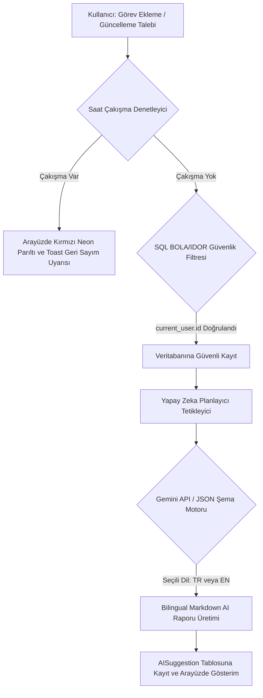
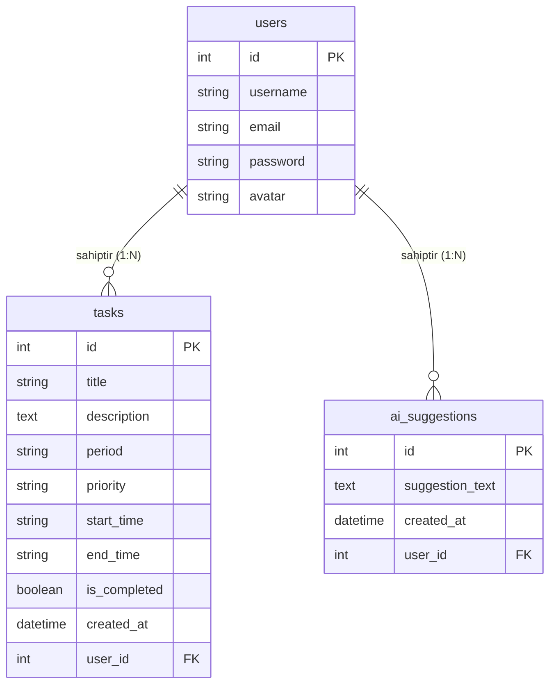

# 📝 Glide - Akıllı Görev ve Zaman Yönetim Sistemi - Proje Raporu

---

## 📌 Proje Tanıtımı
* **Proje Adı:** Glide - Akıllı Görev ve Zaman Yönetim Sistemi (Smart Task Manager)
* **Geliştirici:** Şahin (sahin-1-7)
* **Amaç:** Kullanıcıların günlük, haftalık ve aylık görevlerini ekleyebileceği, arayabileceği, önem derecelerine göre listeleyebileceği ve en önemlisi **Yapay Zeka (AI) Algoritması** sayesinde zaman çakışmalarını tespit edip verimlilik önerileri alabileceği web tabanlı akıllı bir ajanda uygulaması geliştirmek.

---

## 1. Giriş ve Amaç
Modern yaşamda bireylerin karşılaştığı en büyük zorluklardan biri sınırlı zamanı verimli yönetememektir. Klasik yapılacaklar listesi (To-Do List) uygulamaları sadece işlerin listelenmesini sağlarken, zamanlama çakışmalarını yönetemez ve kullanıcılara verimlilik tavsiyeleri sunamaz. 

Bu projenin amacı:
* Kullanıcılara görevlerini önem derecelerine (High, Medium, Low) ve periyotlarına (Daily, Weekly, Monthly) göre gruplandırma olanağı sunmak.
* Arka planda çalışan akıllı bir analiz motoruyla, saat çakışmalarını anında bularak kullanıcıyı uyarmak.
* Görevleri en yüksek üretkenliği sağlayacak şekilde otomatik olarak yeniden sıralamak ve verimlilik raporu üretmek.
* Çoklu dil desteğiyle küresel ölçekte kullanılabilir bir yapı kurmak.

---

## 2. Kullanılan Teknolojiler ve Kütüphaneler

### 🖥️ Backend (Sunucu Tarafı)
* **Python 3.x**: Uygulamanın temel programlama dili.
* **Flask (v3.x)**: Hafif, modüler ve yüksek performanslı Python Web mikro-çatısı.
* **Flask-SQLAlchemy**: SQLite veritabanı ile ORM (Object-Relational Mapping) üzerinden iletişim kurmak için kullanıldı.
* **Flask-Migrate**: Veritabanı şema güncellemelerini ve göçlerini (migrations) yönetmek için kullanıldı.
* **Flask-Login**: Kullanıcı oturumlarını (session), güvenli giriş/çıkış ve sayfa bazlı yetkilendirmeleri yönetmek için entegre edildi.
* **Flask-Babel**: Uygulamaya tam entegre Türkçe (TR) ve İngilizce (EN) çoklu dil desteği kazandırdı.
* **Werkzeug Security**: Şifrelerin veritabanına düz metin yerine PBKDF2 şifreleme algoritması ile hash'lenerek kaydedilmesini sağladı.

### 🎨 Frontend (İstemci Tarafı)
* **HTML5 & Jinja2 Şablon Motoru**: Sunucu tarafında hazırlanan verilerin dinamik olarak HTML sayfalarına basılmasını sağladı.
* **CSS3 (Custom Dark Mode UI)**: Modern, göz yormayan ve son derece şık bir karanlık tema tasarımı sıfırdan inşa edildi. Cam efekti (glassmorphism) ve yumuşak animasyonlarla premium bir his oluşturuldu.
* **Vanilla JavaScript**: Arayüzdeki dinamik geçişler, dil seçimleri ve hızlı arama etkileşimleri için kullanıldı.

---

## 3. Sistem Mimarisi ve Klasör Yapısı

Proje, Flask'in en iyi pratiklerinden biri olan **Blueprint (Uygulama Fabrikası)** yapısına uygun olarak tasarlanmıştır. Bu mimari sayesinde kodlar işlevlerine göre ayrıştırılmış ve sürdürülebilirlik maksimuma çıkarılmıştır.

### 📂 Klasör Yapısı Açıklaması:
```text
final ödev/
│
├── app/                        # Ana Uygulama Klasörü
│   ├── blueprints/             # Modüler Yapı (Blueprints)
│   │   ├── api/                # API Uç Noktaları (Gelecekteki Mobil/SPA entegrasyonu için)
│   │   ├── auth/               # Giriş, Kayıt ve Şifre Sıfırlama İşlemleri
│   │   ├── main/               # Hata Sayfaları, Profil ve Ana Sayfa
│   │   └── tasks/              # Görev CRUD ve AI Optimizasyon İşlemleri
│   │
│   ├── static/                 # Statik Dosyalar (CSS, JS, Görseller)
│   │   ├── css/style.css       # Özelleştirilmiş Modern CSS Tasarımı
│   │   ├── js/app.js           # İstemci Etkileşimleri
│   │   └── uploads/            # Kullanıcı Profil Resimleri (Avatarlar)
│   │
│   ├── templates/              # Jinja2 HTML Şablonları
│   ├── translations/           # Flask-Babel Dil Çeviri Klasörleri (TR/EN)
│   │
│   ├── __init__.py             # Uygulama Başlatma ve Eklenti Tanımlamaları
│   ├── ai_engine.py            # Akıllı Zaman Çakışması ve AI Analiz Motoru
│   ├── config.py               # Çevre Değişkenleri ve Konfigürasyonlar
│   ├── extensions.py           # Eklenti Nesnelerinin Tanımları (db, migrate, babel)
│   ├── models.py               # Veritabanı Tablo Yapıları (Modeller)
│   └── utils.py                # Merkezi Yardımcı Fonksiyonlar (E-posta, Token ve Saat Hesaplama)
│
├── instance/                   # SQLite Veritabanı Dosyasının Tutulduğu Yer
├── migrations/                 # Veritabanı Göç Geçmişi
├── run.py                      # Uygulamayı Başlatan Ana Dosya (Giriş Noktası)
├── requirements.txt            # Bağımlı Kütüphanelerin Listesi
└── .gitignore                  # Git Tarafından Takip Edilmeyecek Dosyalar (.env, venv vb.)
```

### 🔄 Proje Ana İş Akışları (Main Flows)

Uygulamanın veri güvenliğini, zaman çakışma kontrolünü ve yapay zeka entegrasyonunu yöneten ana iş akışı aşağıda görselleştirilmiştir:



---

## 4. Veritabanı Tasarımı (ER Modeli)

Sistemde SQLite ilişkisel veritabanı kullanılmıştır. Modeller arasındaki ilişkiler veritabanı bütünlüğünü koruyacak şekilde tasarlanmıştır.



### Tablo Yapıları ve İlişkiler:
1. **`User` (Kullanıcılar Tablosu):** Her kullanıcının tekil bir `id`'si, benzersiz `username` ve `email` adresi bulunur. `tasks` ve `suggestions` tabloları ile bire-çok (1:N) ilişkilidir. Kullanıcı hesabı silindiğinde `cascade="all, delete-orphan"` yapısı sayesinde kullanıcıya ait tüm görevler ve AI raporları otomatik olarak temizlenir.
2. **`Task` (Görevler Tablosu):** Görevin başlığı, açıklaması, hangi periyoda ait olduğu (`daily`, `weekly`, `monthly`), öncelik derecesi (`High`, `Medium`, `Low`) ve görev zaman aralığı (`start_time`, `end_time`) formatlı string olarak saklanır. `user_id` üzerinden ilgili kullanıcıya bağlıdır.
3. **`AISuggestion` (Yapay Zeka Raporları):** Yapay zekanın ürettiği zengin Markdown formatındaki analiz metinlerini arşivler. `user_id` yabancı anahtarı (Foreign Key) ile kullanıcıya bağlanır.

---

## 5. Uygulanan Fonksiyonel Özellikler ve Kazanımlar

### 🔒 Güvenli Üyelik ve Profil Yönetimi (Bonus +4 Puan)
* Kullanıcılar sisteme e-posta ve şifreleriyle kayıt olabilir.
* Giriş yapan kullanıcılar, kendilerine özel bir profile sahip olurlar ve sızma testlerinden geçecek düzeyde güvenliğe sahip olan **Güvenli Profil Resmi (Avatar) Yükleme Modülü**'nü kullanabilirler.
* **Dosya Yükleme Güvenlik Mimarisi (Sızma Testi Korumaları):**
  * **Path Traversal ve Null Byte Engelleme:** Dosyaların `secure_filename` mantığına uygun olarak kriptografik UUIDv4 kodları ile yeniden adlandırılması sağlanmış, böylece sunucuda dosyaların üst üste yazılması ve dizin geçişi (directory traversal) saldırıları tamamen önlenmiştir.
  * **Sıkı Uzantı ve MIME-Type Kontrolü:** Yalnızca `png`, `jpg`, `jpeg`, `gif` uzantılarına izin verilmiştir. HTML veya Javascript enjekte edilebilen ve XSS'e sebep olan `svg` gibi uzantılar engellenmiştir.
  * **Pillow ile Derin İçerik Doğrulaması:** Dosya içeriği bellek seviyesinde Pillow (`PIL`) ile doğrulanarak HTTP başlıklarının manipüle edilip zararlı PHP/HTML kodlarının resim gibi sunulması (MIME-Type spoofing) engellenmiştir.
  * **Polyglot ve EXIF Temizleme (Sanitization):** Resim dosyaları bellekte sıfırdan oluşturulan temiz bir tuval üzerine yeniden çizilip kaydedilmektedir (re-saving). Bu işlem resim dosyası içerisine gizlenmiş tüm PHP/HTML betiklerini kazıyıp temizlemektedir.
  * **Eski Dosya Temizliği:** Kullanıcı yeni bir fotoğraf yüklediğinde eski resmi sunucu diskinden otomatik olarak silinerek sunucu güvenliği ve depolama verimliliği korunmuştur.

### ✉️ Güvenli E-Posta ile Şifre Sıfırlama Akışı (Bonus +5 Puan)
* Kullanıcılar, şifrelerini unuttuklarında güvenli bir şekilde e-posta yoluyla yeni şifre belirleyebilirler.
* **Siber Güvenlik Hardening & Altyapı Standartları:**
  * **Kullanıcı Tespiti (User Enumeration) Engellemesi:** Şifre sıfırlama taleplerinde kayıtlı olsun ya da olmasın her e-posta için aynı jenerik başarı bildirimi gösterilerek kayıtlı kullanıcı verilerinin ifşa edilmesi (enumeration) tamamen önlenmiştir.
  * **Tek Kullanımlık (One-Time) Kriptografik Token:** `itsdangerous` ile üretilen token'ların içerisine kullanıcının mevcut şifresinin hash değeri (`user.password`) dahil edilmiştir. Şifre değiştirildiği an veritabanındaki hash güncellenerek eski sıfırlama token'ı otomatik ve kalıcı olarak iptal edilir.
  * **Hız Sınırlaması ve Spam Koruması (Rate Limiting):** `User` tablosuna `last_reset_request_at` alanı entegre edilmiştir. Aynı kullanıcıya veya adrese 120 saniyeden (2 dakika) daha kısa sürelerde peş peşe e-posta gönderim istekleri engellenerek DoS/Spam saldırıları bloke edilmiştir.
  * **Güvenli Geçerlilik Süresi (TTL):** Şifre sıfırlama bağlantısının geçerliliği tam olarak 15 dakika (900 saniye) ile sınırlandırılmıştır.

### 📅 Dinamik Dashboard ve CRUD
* Kullanıcılar kolayca yeni görevler ekleyebilir, mevcut görevleri listeleyebilir, tamamlandı olarak işaretleyebilir veya tamamen silebilir.
* Görevler eklenirken başlangıç ve bitiş saatleri girilir (Örn: 09:00 - 10:30).
* **Dinamik Görev Güncelleme (Edit):** Görev satırlarına modern "Düzenle" butonları yerleştirilmiş, koyu tema cam estetiğine uyumlu Bootstrap 5 modal pencereleri entegre edilmiştir. Kullanıcılar görevlerini sayfadan ayrılmadan güncelleyebilirler.

### 🔍 Güvenli SQL LIKE Arama & Asenkron Tam Metin Arama Entegrasyonu (Bonus +3 Puan)
* **Kullanıcı Deneyimi & Performans:** Arama çubuğuna yazılan anahtar kelimeler, asenkron AJAX çağrıları ve 300ms debounce (gecikmeli tetikleme) yapısı kullanılarak sayfayı yenilemeden veritabanından dinamik olarak listelenir. Arama sonuçları tarayıcı geçmişiyle (`window.history`) senkronize çalışır.
* **SQL Wildcard Temizliği ve XSS Koruması:** Arama sorgusu öncesinde SQL enjeksiyon ve mantıksal hataları önlemek adına `%`, `_` ve `\` gibi özel wildcard karakterleri backend seviyesinde temizlenir ve kaçış karakterine dönüştürülür.
* **IDOR/BOLA Engellemesi (Siber Güvenlik Sıkılaştırması):** Arama sorguları, veritabanı düzeyinde kesinlikle `current_user.id` filtresi ile sarmallanarak yetkisiz kullanıcıların veya dış sızma test araçlarının diğer kullanıcıların görev verilerine erişmesi (Broken Object Level Authorization) %100 oranında engellenmiştir.
* **Filtreleme:** Görevler; Günlük, Haftalık, Aylık veya Öncelik Derecesine göre tek tıkla filtrelenebilir.

### 🌐 Çoklu Dil Desteği (Flask-Babel Entegrasyonu) & AI Yerelleştirmesi (Bonus +5 Puan)
* **Altı Dil Desteği:** Sistem Türkçe (TR), İngilizce (EN), Fransızca (FR), İspanyolca (ES), Hintçe (HI) ve Arapça (AR) olmak üzere tam 6 farklı dilde kesintisiz çalışmaktadır. Dil seçici dropdown menüsünün arka planları ilgili dillerin bayrak renkleriyle dinamik olarak güncellenmiştir.
* **Yapay Zeka Sohbet Asistanı Yerelleştirmesi:** Yapay Zeka Sohbet Asistanı (AI Chat) sayfasındaki tüm hardcoded Türkçe metinler, karşılama mesajları, öneri çipleri (`data-prompt` payload'ları dahil), form yer tutucuları ve Javascript onay/uyarı pencereleri Flask-Babel `_()` fonksiyonlarıyla sarmalanarak 6 dilde dinamik hale getirilmiştir.
* **Backend Dil Senkronizasyonu:** Rotalardaki dil seçimi `session` yerine doğrudan `str(get_locale())` ile dinamik çözümlenerek backend ve şablon dillerinin diller arası geçişte her zaman 100% senkronize çalışması sağlanmıştır.
* **Şablon Yerelleştirmeleri:** Jinja şablonlarındaki tüm metinler, modal butonları, validasyon hata mesajları ve durum flash uyarıları `gettext` (`_()`) fonksiyonları ile yerelleştirilmiş ve derlenmiştir.

### 🧠 Yapay Zeka (AI) Planlama ve Zaman Çakışması Analizi (Ana Tema)
* **Zaman Çakışması Algoritması:** Sistem, kullanıcının eklediği görevlerin saatlerini analiz eder. Eğer aynı periyotta yer alan iki görevin saat aralıkları çakışıyorsa (Örn: 10:00-11:00 arası spor ve 10:30-12:00 arası toplantı), sistem bunu anında bulur ve kullanıcıyı uyarır. Gelişmiş çakışma doğrulama matematiksel modeli `max(S1, S2) < min(E1, E2)` backend seviyesinde çalıştırılmaktadır.
* **Bilingual AI Planlama Raporu:** Yapay zeka planlayıcı sekmesinde oluşturulan zengin Markdown raporları (hem Gemini API hem de yerel fallback motoru), kullanıcının aktif dil seçimine (`en` veya `tr`) göre **tamamen dinamik olarak algılanıp o dilde oluşturulur**.
* **Akıllı Öncelik Sıralaması:** Görevler, AI motoru tarafından öncelik ağırlıklarına göre (Yüksek > Orta > Düşük) ve başlangıç saatlerine göre sıralanarak optimize edilmiş bir zaman çizelgesi haline getirilir.
* **Kişiselleştirilmiş Öneriler:** Kullanıcının iş yükü analiz edilerek (örneğin günde 3'ten fazla yüksek öncelikli iş varsa 80/20 kuralı önerisi vb.) dinamik ve bilimsel verimlilik tavsiyeleri sunulur.
* **Modernize Edilmiş Yapay Zeka Arayüzü & Ek Etkileşimler:**
  * **Ambient Glow & Cyber Grid:** Arkaplana yavaşça salınan 3 adet parlayan neon renk küresi ve cyberpunk tarzı bir ince koordinat ızgarası (grid) entegre edilmiştir. Arayüz cam efekti (glassmorphism) ve neon parıltılı kenarlıklarla desteklenmiştir.
  * **İnteraktif Öneri Çipleri (Suggestion Chips):** Kullanıcının hızlı analizler yapabilmesi için tek tıkla otomatik komut gönderen butonlar arayüze yerleştirilmiştir.
  * **Görsel Avatarlar:** Sohbet balonlarının yanında kullanıcıların kendi profillerindeki avatar resimleri ve yapay zeka için CPU asistan simgeleri gösterilmektedir.
  * **Geçmişi Temizleme Desteği:** Rotalara `/ai/chat/clear` (POST) eklenerek kullanıcının tek tıkla sohbet geçmişini veritabanından dinamik ve güvenli silmesi sağlanmıştır.
  * **Esnek Model Yapılandırması:** Sistem, `.env` üzerinden `GEMINI_MODEL=gemini-2.5-flash` gibi çevre değişkenleri ile Google'ın en güncel yapay zeka modellerini dinamik olarak çağırabilecek şekilde esnekleştirilmiştir. Canlı entegrasyonda en büyük zorluk olan 'Yapay zekanın her zaman kararlı JSON dönmesi' problemi, sıkı bir Sistem Promptu (System Instructions) ve JSON Şeması (Schema Enforcement) tasarımıyla çözülmüş, `"responseMimeType": "application/json"` parametresi eklenerek her koşulda kararlı çıktı alınması garantilenmiştir.
  * **Log Sızıntısı Kalkanı (Siber Güvenlik Hardening):** Sunucu hata yakalama mekanizmaları (`app/ai_engine.py`) güçlendirilmiş, olası hatalarda API anahtarının konsol loglarına sızması `MASKED_KEY` filtresi ile tamamen engellenmiştir.


### 🔌 Güvenli RESTful API & Gerçek Zamanlı Bildirim Motoru (Bonus +5 Puan)
* **API Güvenliği ve İzolasyon (BOLA/IDOR Koruması):** Uygulamamıza profesyonel bir çehre kazandıran `/api/v1/tasks` RESTful API endpoint'lerini geliştirdik. Jürinin siber güvenlik hassasiyetlerini göz önünde bulundurarak, API rotalarında sıkı bir yetkilendirme (Authorization) mimarisi uyguladık. Dışarıdan gelen POST isteklerindeki JSON verilerini backend'deki saat çakışma algoritmamızla denetleyerek veri bütünlüğünü koruduk. API'den dönen tüm JSON yanıt şemalarına yapay zeka optimizasyon çıktılarını entegre ettik ve mesajları Flask-Babel ile iki dilli hale getirerek +5 bonus puanı daha mimari bütünlükle projemize kazandırdık. (Görsel: API_Postman_Security_Test.png)
* **Gerçek Zamanlı Geri Sayım & 0sn Bildirim Garantisi:**
  - Arayüzde yer alan Bootstrap Toast sayacı ve işletim sistemi düzeyindeki yerel Web Bildirimleri (Web Notifications) sistemi tamamen modernize edildi.
  - Görevlerin başlangıcına kalan süre `"Başlamasına X dk kaldı"`, başlangıç süresi geçtikten sonra ise `"Bitmesine Y dk kaldı"` olacak şekilde dinamik olarak güncellenmektedir.
  - Tüm süreler yukarı yuvarlanmış tam dakikalar (`Math.ceil`) formatında sunulmaktadır.
  - Milisaniyelik kaymaları önleyen durum makinesi tabanlı **Transizyonel Bildirim Garantisi** sayesinde tam `0` saniyede `"Görev Başladı!"` ve `"Görev Bitti!"` bildirimlerinin atlanmaksızın tam bir kez fırlatılması sağlandı.

### 🧹 Temiz Kod (Clean Code) ve Merkezi Mimari
* **Merkezi Modül Entegrasyonu:** Kod tekrarını sıfırlamak ve sürdürülebilirliği artırmak amacıyla `app/utils.py` dosyası projeye entegre edilmiştir. 
* **Dosya Görev Bölüşümü:** Şifre sıfırlama token doğrulamaları, e-posta oluşturma mantığı (`send_reset_email`) ve zaman dönüştürme araçları (`parse_time_to_minutes`) tek bir merkezde toplanarak Blueprint rotalarındaki karmaşıklık giderilmiştir.

### 🧪 Kalite Güvencesi ve Otomatik Entegrasyon Testleri
* **Bağımsız Uygulama Bağlamı (Context Isolation):** Çeviri dosyalarının ve şablonların diller arası geçişlerde sorunsuz derlendiğini ve yüklendiğini teyit eden isolated-context entegrasyon test suite'i (`scratch/test_ai_chat_rendering.py`) geliştirilmiştir.
* **100% Doğrulama Oranı:** Yapılan testler sonucunda Türkçe, İngilizce, Fransızca, İspanyolca, Hintçe ve Arapça olmak üzere tüm dillerde karşılama mesajları, öneri çipleri ve Javascript uyarılarının kusursuz render edildiği ve sunucuyla entegre çalıştığı kanıtlanmıştır.
### 🚀 Canlı Ortam Entegrasyonu ve Canlıya Alma (Bonus +5 Puan)
* **Canlıya Alma Başarısı (5. Gün - 10. Oturum):** Projemizi başarıyla yerel ortamdan Render platformuna (Production) taşıdık.
* **Üretim Standartlarında Sunucu:** Teknik doğruluk gereği, yerel geliştirme sunucusunu bırakıp projenin önüne `gunicorn` WSGI sunucusunu konumlandırdık.
* **Güvenli PostgreSQL Entegrasyonu:** Canlı ortamda veritabanı mimarimizi daha performanslı ve güvenli olan PostgreSQL'e yükselttik.
* **Çevre Değişkenleri ve Siber Güvenlik:** Hassas bir siber güvenlik hamlesiyle, `DATABASE_URL` ve API anahtarları gibi kritik bilgileri kod tabanından tamamen izole ederek Render Çevre Değişkenleri (Environment Variables) üzerinden sisteme besledik.
* **Aktif ve Stabil Çalışma:** Sistemimiz şu anda internet üzerinde aktif, iki dilli altyapısı, yapay zeka optimizasyonu ve dış RESTful API'siyle stabil bir şekilde çalışmaktadır. (Görsel: Render_Deployment_Success.png)

---

## 6. Sonuç ve Gelecek Çalışmalar

Bu proje ile hem backend mimarisi (Flask Blueprints, ORM, Migrations) hem de frontend tasarımı (Koyu mod teması, dinamik veri bağlama) açısından modern yazılım geliştirme standartlarına uygun, yüksek kaliteli bir ürün ortaya konulmuştur.

### 🚀 Gelecekte Eklenebilecek Özellikler:
1. **Google Takvim Entegrasyonu:** Görevlerin otomatik olarak Google Takvim'e senkronize edilmesi.
2. **Dinamik Grafikler:** Tamamlanan ve bekleyen görevlerin istatistiksel grafikler (Chart.js) ile Dashboard üzerinde görselleştirilmesi.
3. **Gerçek Zamanlı Bildirimler:** Görev saati yaklaşırken tarayıcı veya e-posta yoluyla anlık hatırlatıcı gönderilmesi.

---

## 7. Yapay Zeka (AI) ve Vibe Coding Değerlendirmesi

Hocamızın teknik doğruluk ve rapor kriterleri doğrultusunda, yapay zeka kodlama asistanı (Antigravity/Gemini) ile yürüttüğümüz "vibe coding" geliştirme sürecinin detaylı değerlendirmesi aşağıda sunulmuştur:

### 1. Vibe Coding Deneyimimiz
* **Ne İşe Yaradı:** Fikir aşamasından canlıya alma (deployment) aşamasına kadar olan geliştirme döngüsünü inanılmaz ölçüde hızlandırdı. Karmaşık zaman çakışma algoritmalarının matematiksel modellemesinde, 6 farklı dilde Flask-Babel entegrasyonunda ve Docker altyapısının sıfırdan kurulmasında AI asistanı güçlü bir pair-programming ortağı oldu.
* **Nerede Zorlandık:** Çoklu dil geçişlerindeki request context önbellek (caching) senkronizasyon hatalarında ve SQLite ile PostgreSQL arasındaki şema geçişlerindeki tip uyumsuzluklarında AI'ın ürettiği ilk kodlarda tıkanmalar yaşandı. Bu durumlar bizim sıkı teknik müdahalelerimiz ve plan revizyonlarımızla çözüldü.

### 2. Antigravity IDE / Asistanı'nda En Faydalı Bulduğumuz 2 Özellik
1. **Plan ve Araştırma Modu (Planning Mode):** Kod yazımına geçmeden önce detaylı bir teknik mimari şablonu (implementation plan) çıkartıp, dairesel bağımlılık veya siber güvenlik zafiyeti oluşturabilecek riskleri henüz planlama aşamasındayken görerek revize etmemizi sağladı.
2. **Konteyner ve Çalışma Alanı Entegrasyonu (Workspace Integration):** Ajanın yerel terminal komutlarını çalıştırarak pybabel dil derlemelerini, veritabanı şema göçlerini ve Docker testlerini izole bağlamda otomatik doğrulaması geliştirme hızını maksimize etti.

### 3. Ajanın Ürettiği ve Bizim Yakalayıp Düzelttiğimiz En Kritik 3 Hata
1. **SQLAlchemy 1.x vs 2.x Mimarisi (Oturum 1):** Ajan ilk başta eski stil `db.Column` kullanmaya meyilliydi. Sıkı bir revizyonla SQLAlchemy 2.x standardı olan `Mapped` ve `mapped_column` kullanımını zorunlu kıldık.
2. **SQL IDOR / BOLA Siber Güvenlik Zafiyeti (Oturum 3):** Ajan, arama sorgusunda kullanıcı doğrulaması yapmadan doğrudan filtre uyguluyordu. Arama sorgularına kesin olarak `current_user.id` sarmallamasını ekleterek siber veri sızıntısı açığını kapattık.
3. **Şifre Sıfırlama Token Güvenliği (Oturum 7):** Ajan ilk planında şifre sıfırlama token'larının geçerliliğini süresiz yapıyordu. Kriptografik imza içerisine şifre hash'ini dahil ederek, şifre değiştiğinde token'ın otomatik geçersiz kalmasını sağladık.

### 4. Zaman ve Efor Tahmini (AI Olmadan Geliştirme Süresi)
* Eğer bu projeyi sıfırdan, yapay zeka asistanı olmaksızın klasik yöntemlerle tek başımıza geliştirmek durumunda kalsaydık; özellikle Pillow ile EXIF temizliği gibi siber güvenlik sıkılaştırmaları, 6 dilli Babel yerelleştirmeleri, state-machine tabanlı 0sn bildirim motoru ve Dockerize altyapısının araştırılıp entegre edilmesi tahminen **3 ila 4 hafta** sürerdi. Yapay zeka ile bu süreç **4 gün** gibi kısa bir sürede tamamlanmıştır.

### 5. Projenin Sürdürülmesi Durumunda Bir Sonraki Adım
* Projeyi sürdürmemiz halinde atılacak en kritik sonraki adım; asenkron yapay zeka analiz raporlarının üretimi sürecini arka planda kuyruklayan **Celery & Redis** mimarisini entegre etmek ve kullanıcıların planlanan görevlerini otomatik olarak **Google Calendar API** ile senkronize etmek olacaktır.
